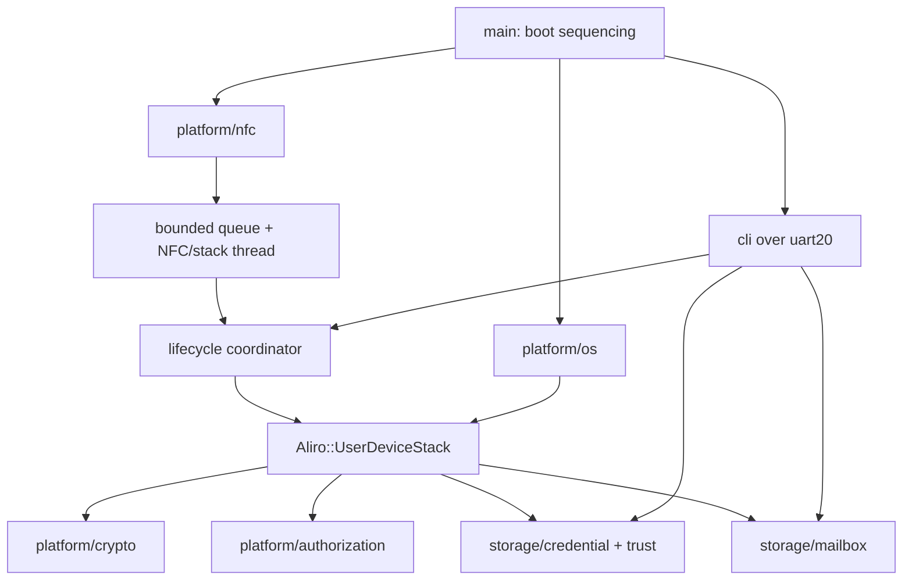

# Aliro NFC User Device Application — Implementation Plan

Build the Phase 1 Aliro NFC User Device application for the nRF54LM20B DK,
replacing the proof of concept under
`applications/aliro-nfc-user-device`.

Every Agent invocation MUST be given `TARGET_AWP=AWPx`, MUST execute exactly
that Application Work Package, and MUST then stop. If `TARGET_AWP` is absent,
ambiguous, already complete, or has an incomplete prerequisite, ask the user
instead of choosing a package or continuing into another one.

Authoritative inputs, in precedence order:

1. Aliro Specification v1.0, queried through the `aliro-spec` MCP.
2. `applications/aliro-nfc-user-device/docs/Requirements.pdf`, Phase 1
   requirements `ALIRO-UD-SYRS-P1-001` through `-040`.
3. The checked-out public User Device headers and Kconfig under the west
   project `ncs-aliro`.
4. Existing repository conventions, for structure only. Reader applications
   are not a source of User Device protocol behavior.

The specification and SyRS define required behavior. Public `ncs-aliro`
headers define the available integration contract; they do not weaken or
override normative behavior. If the public contract cannot represent required
behavior, report an external stack blocker.

## 1. Boundaries and working rules

### Application versus stack

The application owns:

- nRF54LM20B DK and antenna bring-up.
- NFC-A Type 4 Tag/ISO-DEP listen transport and field events.
- Zephyr execution primitives, timers, queues, and synchronization.
- PSA/CRACEN/KMU bindings.
- Credential, per-reader-group trust, key, optional-document, and mailbox
  persistence.
- Button authorization, visible indication, and the development CLI.
- Implementations required by the checked-out
  `Aliro::Interface::UserDevice::*` contract.

The stack owns:

- Aliro APDU and TLV encoding, decoding, chaining, and status words.
- Session and Access Protocol state machines.
- `SELECT`, `AUTH0`, `LOAD CERT`, `AUTH1`, `EXCHANGE`, and `CONTROL FLOW`
  behavior.
- Aliro cryptographic orchestration and policy.

Use the checked-out `Aliro::UserDeviceStack` facade for all stack-owned
behavior. Do not add application fallbacks for absent or incomplete stack
features.

### Invocation, repository, and commit contract

- Modify only this repository. Never modify the sibling `ncs-aliro` checkout.
- Preserve unrelated staged, unstaged, and untracked work. Stage only files
  produced for `TARGET_AWP`.
- The agent shall use the currently explicitly checked out revision of `ncs-aliro`. 
  The Agent MUST record the exact tested  revision and MUST NOT silently run 
  `west update` or change stack revisions.
- One invocation may create one commit, or a short cohesive commit stack,
  titled `aliro_ud: AWPx: <short summary>`.
- If any verification required by the target AWP cannot be run, including a
  DK demonstration, report the exact blocker, and ask the user before continuing, 
  for potential resolution of the blocker:  commit and call the AWP complete only 
  after the user allows.

### Stack-version independence

The stack is developed independently from this application. Do not assume a
specific newer stack work package, branch state, command set, or interim
response beyond the minimum baseline.

At the start of each AWP:

1. Record `git -C <west-topdir>/ncs-aliro rev-parse HEAD` and verify it is the
   minimum baseline (b8bed857b482d288168185e76d5452469739fbdd) or
    a descendant.
2. Inspect the checked-out public User Device headers and Kconfig.
3. Compare the contract with the normative behavior needed by this AWP.
4. Implement adapters only when they preserve required semantics, require
 confirmation from the user.
5. If a contract is absent or cannot represent required semantics, stop that
   integration path with a precise external blocker. Do not modify
   `ncs-aliro`, add hidden state that relies on undocumented callback order, or
   narrow required behavior to fit the API.
6. Test application-owned behavior independently of protocol features not
   exposed by the current stack.
7. Run end-to-end checks only for capabilities the current stack declares or
   implements; record unavailable checks as `not-yet-verifiable`, not as
   application failures.

Never infer protocol behavior from a stack development milestone. When the
stack revision changes, rebuild and rerun the integration suite.

### Engineering rules

- Add tests with each AWP. Prefer Zephyr `ztest` on `native_sim`/`native` for
  host-testable logic. A written DK checklist is preparation, not evidence that
  a required DK demonstration passed.
- Use fakes or in-memory backends owned by this application; do not depend on
  stack test-only code.
- Remain powered while idle. System OFF and automatic power-down are not part
  of Phase 1 and MUST NOT be implemented by these AWPs.
- Query `aliro-spec` before deciding any ambiguous protocol field, timing,
  cryptographic input, or mailbox-rights semantic. Record the normative
  citation beside the resulting test or design note.
- Create `applications/aliro-nfc-user-device/docs/traceability.md` and an
  evidence log in AWP0, then update both in every AWP rather than deferring
  traceability to the final package.

## 2. Target architecture

`main` performs boot sequencing only. `platform/*` and `storage/*` implement
the application side of the current public User Device contract.

`nfc_t4t_lib` callbacks only copy/assemble bounded transport data and enqueue
events. A dedicated high-priority application thread serializes NFC lifecycle,
complete C-APDU delivery, stack events, and response transmission. Queue
overflow, stale events, duplicate field events, and field-loss races terminate
and reset application session state deterministically.

The NFC adapter copies every stack response into an application-owned transmit
buffer. That buffer remains unchanged until the next `nfc_t4t_lib` callback,
including `NFC_T4T_EVENT_DATA_TRANSMITTED`, `NFC_T4T_EVENT_DATA_IND`, or
`NFC_T4T_EVENT_FIELD_OFF`.

Read-only CLI operations may run during a session. A mutating CLI commit is
serialized through the lifecycle thread: prevent new activation, terminate the
active stack session, apply the storage transaction, then resume NFC service.

## 3. Work packages

### AWP0 — Replace POC logic with the application skeleton

Deliver:

- Remove AID matching, APDU inspection, and the placeholder `6A82` response
  from `main.c`; these are protocol behavior.
- Remove System OFF scheduling, wake-reason handling used only by System OFF,
  and automatic power-down. Remain powered while idle.
- Require the `ncs-aliro` baseline
  `b8bed857b482d288168185e76d5452469739fbdd`; do not reset an explicitly
  checked-out newer descendant.
- Enable the checked-out User Device stack through its current Kconfig
  interface. Do not add manual link wiring if the module supplies Kconfig and
  CMake integration.
- Create `src/platform/{nfc,os,crypto,authorization}`,
  `src/storage/{credential,mailbox}`, and `src/cli`, each with appropriate
  CMake files. Do not reuse Reader-only sources.
- Create `docs/traceability.md` with one row for every Phase 1 requirement and
  `docs/evidence.md` with the target AWP, exact stack revision, commands run,
  verification method, result, and external blockers.

Verify:

- Build the DK target.
- Add a host smoke build that links the User Device facade and initializes it
  through the current public API.
- Confirm a clean manifest checkout resolves a User Device stack at or above
  the minimum baseline.

Covers: application build evidence for `ALIRO-UD-SYRS-P1-001`. No protocol
requirement is complete in this package.

### AWP1 — NFC transport, OS bridge, and stack lifecycle

Deliver:

- In `platform/nfc`, connect `nfc_t4t_lib` raw ISO-DEP events to the current
  stack session and command-APDU facade.
- Use a bounded queue and dedicated high-priority NFC/stack thread. Library
  callbacks may copy fragments and enqueue events only; they MUST NOT execute
  stack, storage, shell, or cryptographic operations directly.
- Implement the current `Interface::UserDevice::Nfc` contract, including
  response transmission, termination, and timing constraints where required.
- Keep transport fragment assembly in this module. Do not parse Aliro APDUs.
- Copy each response APDU into a dedicated transmit buffer and retain it,
  unchanged, until the next NFC callback releases it.
- In `platform/os`, implement the current event, mutex, timer, and trusted-time
  contract with Zephyr primitives. Return no trusted wall-clock timestamp;
  Phase 1 does not provision a wall clock or enforce Reader-certificate
  validity dates.
- Initialize the stack at boot. Map field activation/removal to stack session
  lifecycle calls. Remain powered when idle.
- Route stack-queued events back only to `UserDeviceStack::ProcessEvent()` on
  the dedicated thread.

Verify:

- Unit-test fragment assembly, queue bounds, queue overflow, stale events,
  duplicate activation/removal, field-loss races, timer and mutex wrappers,
  NFC-to-stack call ordering, and response-buffer lifetime with fakes.
- If the current stack supports Aliro `SELECT`, verify its response against the
  specification. Test additional commands only when supported.

Covers: application transport portions of `ALIRO-UD-SYRS-P1-001` and `-002`.
`-013` and `-014` remain stack-owned and may become
`verified-end-to-end`, not `app-implemented`.

### AWP2 — Development CLI over virtual UART

Deliver:

- Enable the Zephyr shell on the DK virtual UART and configure 115200-8N1.
- Add an `aliro-ud` root command and an `info` command that reports non-secret
  build, initialization, and session state.
- Add credential staging command shells for `begin-create`, `begin-update`,
  field setters, `commit`, and `abort`; AWP3 supplies their storage behavior.
- Reserve inspection, deletion, selection, trust-binding, document, and mailbox
  subcommands for AWP3/AWP6.
- Every command returns one deterministic machine-readable success or error
  line and never prints secret values.

Verify:

- Test `info` with the native shell harness.
- Build-check the shell and UART configuration.
- On the DK, demonstrate command input and deterministic output at 115200-8N1.

Covers: `ALIRO-UD-SYRS-P1-003`. Credential-management coverage begins only in
AWP3.

### AWP3 — Credential and trust persistence

Deliver:

- Store non-secret metadata using Zephyr settings/NVS.
- Keep the board's default 36 KiB storage partition. Add Kconfig maxima with
  defaults of four credentials, 16 reader-group bindings per credential, a
  512-byte mailbox per credential, and 1 KiB each for optional Access and
  Revocation Documents. Fail the build if worst-case committed data, one
  staged credential generation, journal records, and NVS garbage-collection
  headroom do not fit.
- Accept an Access Credential private key only as exactly 32 big-endian P-256
  scalar bytes encoded in hex. Validate the scalar, import it into persistent
  PSA/CRACEN/KMU-backed storage, derive its public key, and retain only an
  opaque PSA key identifier in credential records.
- Implement the current `Interface::UserDevice::Credential` and `Trust`
  contracts only if they can preserve the per-binding trust model below.
- Model every binding as
  `reader_group_identifier + trust_type + reader_group_identifier_key`, where
  the key is either a directly bound Reader public key or a Reader System
  Issuer CA public key. Multiple bindings on one credential may use different
  keys.
- The checked-out baseline's
  `Trust::GetReaderPublicKey(CredentialHandle)` and
  `GetReaderIssuerPublicKey(CredentialHandle)` are not binding-aware. Do not
  cache a “last resolved identifier” or force bindings to share a key. Stop
  AWP3 without committing and report the required binding-aware stack contract
  unless the checked-out public API has been corrected.
- Implement one in-memory CLI staging transaction:
  - `begin-create` starts an empty candidate and `begin-update <handle>` clones
    only non-secret state while retaining the existing opaque key reference.
  - field commands set/clear the raw private-key input, binding entries,
    signed timestamps, mailbox configuration, and optional Access/Revocation
    Documents.
  - `commit` validates the complete candidate and is the only operation that
    changes persistent state; `abort` discards and clears staged data.
  - add deterministic create, update, inspect, delete, factory-reset, binding
    enumeration, and preferred-credential selection commands.
- Persist the preferred credential per shared reader identifier so each
  matching credential can be selected for use.
- Use an application-specific persistent transaction journal spanning NVS and
  PSA key storage. Import/stage a replacement key, record intent, atomically
  switch committed metadata, retire the old key, and clear the journal.
  Boot-time recovery MUST finish or roll back interrupted transactions and
  destroy unreferenced staged keys.
- A mutating `commit`, delete, or factory reset MUST run through the lifecycle
  coordinator: prevent activation, terminate any active session, perform the
  transaction, then resume NFC.
- Preserve credentials, per-binding trust, policies, timestamps, optional
  documents, mailbox configuration/data, and any opaque persistent-key state
  across reset and power loss until explicit deletion/reset. Never expose
  private key, `Kpersistent`, or session-key bytes.

Verify:

- Test create/update/delete/reset, four-credential capacity, 16 distinct
  binding keys on one credential, duplicate identifiers, preferred selection,
  malformed scalar/input, over-capacity rejection, lookup, and optional
  document bounds.
- Inject failure before and after every journal transition and verify rollback
  or recovery, prior-state preservation, staged/orphan key destruction, and
  idempotent reboot recovery.
- Test that CLI and logs never print private key material.
- Independently test this backend even if the current stack does not call every
  interface yet.
- On the DK, use only the UART CLI to provision, inspect, update, select,
  delete, and factory-reset credentials; demonstrate persistence over reset and
  actual power loss and confirm protected keys remain non-exportable.

Covers: application persistence and CLI portions of
`ALIRO-UD-SYRS-P1-004` through `-010`, plus persistence/configuration portions
of `-032`. Authentication and end-to-end protocol coverage remains assigned
to later packages or `not-yet-verifiable`.

### AWP4 — Local authorization and visible indication

Deliver:

- Implement the current `Interface::UserDevice::Authorization` contract using
  a DK button.
- Provide a Kconfig-controlled authorization window from 1 to 300 seconds,
  defaulting to 30 seconds.
- Apply the application policy that AUTH0 authentication-policy values `0x01`,
  `0x02`, and `0x03` all require a valid button authorization window.
- Show an LED indication when authorization is required and no valid window
  exists.
- Do not wait inside the NFC transaction for a button press. Return the
  synchronous `Required` state so the stack fails promptly, indicate that
  authorization is needed, and allow a new transaction to succeed after a
  button press opens the window.

Verify:

- Unit-test all three policy values, preauthorization, retry, expiry, denial,
  repeated presses, and 1/300-second boundaries with a fake monotonic clock.
- Demonstrate button and LED behavior on the DK.
- Provide an application test trigger if the current stack cannot request
  authorization end to end.

Covers: application portions of `ALIRO-UD-SYRS-P1-011`, `-012`, `-020`, and
`-021`. End-to-end policy enforcement remains stack-dependent.

### AWP5 — PSA cryptography backend

Deliver:

- Implement the current `Interface::UserDevice::Crypto` and credential-signing
  contracts. Keep ordinary key and cipher operations as thin PSA Crypto
  bindings.
- Include random generation, ephemeral key generation, raw key agreement, key
  derivation, AEAD, signature verification/signing, SHA-256, certificate
  validation, and key destruction as required by the checked-out headers.
- Keep Aliro-specific KDF construction and protocol sequencing in the stack.
- Sign only through an opaque credential handle resolved to its persistent PSA
  key identifier; never copy a stored private scalar back into application
  memory.
- Certificate validation is not a thin PSA operation. Accept the Aliro
  profile0000 DER structure received from the stack, validate and decompress
  it according to Aliro section 13.3, reconstruct the constrained X.509
  certificate, verify its signature using the per-binding Reader System Issuer
  CA public key, and return the subject Reader public key.
- Do not add a wall clock and do not enforce Reader-certificate validity dates.
  Continue to validate the certificate's required shape, encoding, key usage,
  issuer signature, and trust binding.

Verify:

- Use independently sourced known-answer vectors for ECDH,
  HKDF/HMAC-SHA-256, AES-GCM encrypt/decrypt, ECDSA, SHA-256, and certificate
  profile0000 decompression/validation.
- Test malformed profile fields, incorrect signatures, wrong issuer keys,
  invalid P-256 keys, AEAD authentication failures, failure paths, and
  idempotent key cleanup.
- Validate the backend directly regardless of which operations the current
  stack exercises.
- Run the vectors on the target DK as well as the host-capable backend and
  confirm the intended PSA/CRACEN/KMU driver path from build/runtime evidence.

Covers: application/platform portions of `ALIRO-UD-SYRS-P1-008`, `-018`,
`-022` through `-027`, and `-038`. Exact authentication data, KDF inputs,
counters, failure status, and protocol sequencing remain stack-owned.

### AWP6 — Mailbox persistence

Deliver:

- Implement the current `Interface::UserDevice::Mailbox` contract with
  snapshots, staged mutation, atomic commit, rollback, and close semantics.
- Enforce overflow-safe bounds, per-credential sizes, and provisioned
  permissions.
- Complete CLI commands for mailbox inspection, read, initialization, and
  reset. Mailbox size and rights remain part of the credential staging
  transaction from AWP3.
- Keep committed reads isolated from staged writes. Commit all writes/sets in
  one mailbox session atomically; rollback or close without commit leaves
  committed bytes unchanged.

Verify:

- Test read, write, set, bounds rejection, permissions, commit, rollback, and
  close, including overflow arithmetic, conflicting staged operations, and
  injected storage failures against an in-memory backend.
- Test recovery from reset/power-loss injection at each mailbox commit
  transition.
- Validate independently if the current stack does not yet exercise mailboxes.
- On the DK, provision and modify mailbox data through the CLI, verify reset
  and power-loss persistence, and, when supported by the stack, demonstrate
  authorized NFC read/write/set plus rollback on a failed EXCHANGE.

Covers: application/backend portions of `ALIRO-UD-SYRS-P1-032` through `-036`.
EXCHANGE parsing, permission orchestration, and secure-channel success/error
sequences remain stack-owned.

### AWP7 — Timing and resource instrumentation

Deliver:

- Measure the application boundary from command delivery to response send.
- Report flash and RAM use from the build.
- Keep instrumentation lightweight and removable from production builds.
- Query the Aliro test plan for the exact timing bounds applicable to the
  selected PICS and record citations and measurement points.

Verify:

- Test monotonic duration recording, wraparound handling, and disabled-build
  behavior with synthetic transactions.
- Record a reproducible DK timing and size report with build configuration,
  stack revision, toolchain version, transaction type, sample count, maximum,
  and margin to each applicable bound.
- Measure complete protocol timing only for transactions supported by the
  checked-out stack.

Covers: application instrumentation and analysis for
`ALIRO-UD-SYRS-P1-040`; mark the requirement `verified-end-to-end` only after
every applicable selected-PICS bound passes on the target DK.

### AWP8 — Documentation, acceptance evidence, and final traceability

Deliver:

- Update `README.md` and `docs/architecture.md` to describe the implemented
  application and its stack boundary.
- Complete the `docs/traceability.md` created in AWP0, mapping every Phase 1
  requirement to application files, stack ownership, tests, DK evidence,
  normative citations, and one status:
  - `app-implemented`
  - `verified-end-to-end`
  - `not-yet-verifiable` with the missing external capability
  - `blocked-external-contract` with the exact missing public contract
- Do not encode stack work-package numbers in statuses.
- Finalize `docs/evidence.md` with exact commands, revisions, target results,
  selected PICS, timing/resource reports, and outstanding blockers.
- Document the field-based provisioning workflow and every deterministic CLI
  result without including real secret values.

Verify:

- Check every `ALIRO-UD-SYRS-P1-*` requirement is represented once.
- Check documented commands and paths against the built application.
- Re-run all host tests, the DK build, every application-owned DK
  demonstration, and every end-to-end transaction supported by the checked-out
  stack.
- Confirm no Phase 2 or excluded behavior is reported as Phase 1 evidence.

## 4. Verification and completion

For each AWP:

1. Confirm `TARGET_AWP`, its prerequisites, the working-tree baseline, and the
   exact `ncs-aliro` revision before editing.
2. Add host tests and executable/documented DK demo steps with the
   implementation.
3. Run every host, build, inspection, analysis, and DK check required by that
   AWP. Do not treat a written hardware checklist as a passing demonstration.
4. Map actual evidence to the SyRS verification method (`T`, `D`, `I`, or
   `A`) in `docs/evidence.md` and update the affected traceability rows.
5. Separate application defects, unavailable stack capabilities, and
   inadequate public stack contracts.
6. Record Aliro specification citations used to resolve ambiguity.
7. Verify that CLI output, logs, test diagnostics, and committed evidence
   contain no private key, `Kpersistent`, or session-key material.
8. Commit only when every required check passes. If hardware or another
   required verifier is unavailable, leave the changes uncommitted and report
   the remaining command or physical action precisely - ask the user for further steps.
9. Stop after reporting the target AWP result. Never begin the next AWP in the
   same invocation.

After any stack update:

1. Record and validate the new revision as a descendant of the minimum
   baseline.
2. Re-audit the public contract; remove adapters only when the replacement
   preserves the same required behavior.
3. Rebuild the application and run all host tests.
4. Run NFC lifecycle and every supported-transaction regression test on the
   DK.
5. Update `not-yet-verifiable` or `blocked-external-contract` entries only
   when evidence shows the relevant capability or contract changed.

## 5. Explicit exclusions

- Bluetooth LE, UWB, and combined BLE/UWB flows.
- Reader/poll mode, access decisions, and lock actuation.
- Production provisioning authorization, enclosure, and mobile-device work.
- System OFF, automatic power-down, and idle-current optimization.
- Extended-length APDUs, User Device Descriptor, Reader notification,
  bound-application notification, and `update_doc`.
- Credential Issuer backend protocol; the development CLI provides local
  provisioning.
- All Phase 2 requirements (`ALIRO-UD-SYRS-P2-*`), including mandatory User
  Device Step-Up and selected Expedited Fast.
