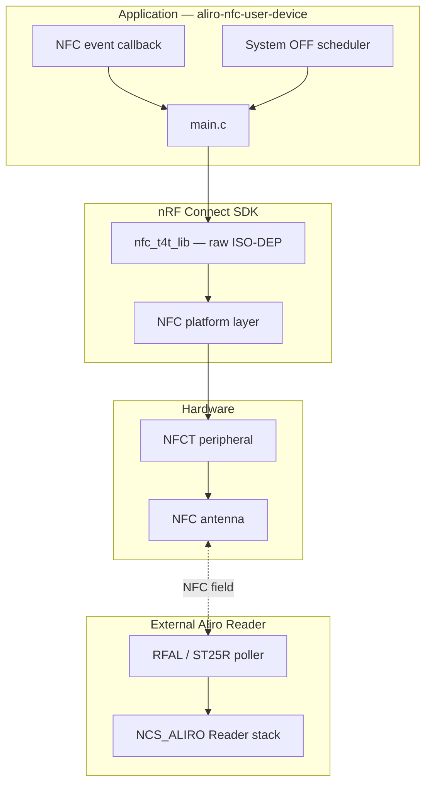
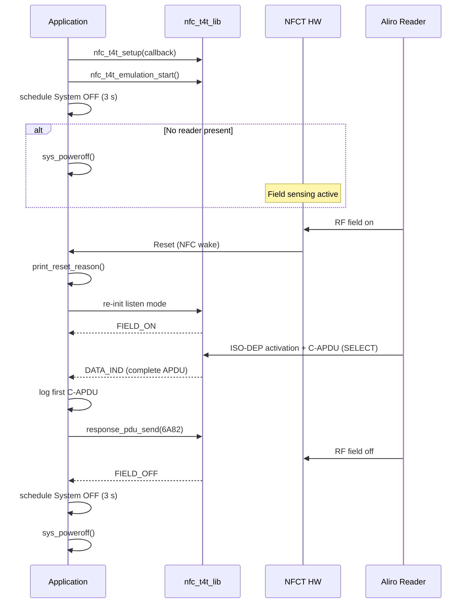

# Aliro NFC User Device POC — Architecture

This document describes how the proof-of-concept application is structured, how it relates to the Aliro specification, and how the nRF54LM20B DK NFC hardware is used.

## Purpose

The goal of this POC is to validate the lowest layers of an Aliro User Device on Nordic hardware:

1. NFC listen-mode operation on the DK's integrated NFCT peripheral
2. Low-power standby using System OFF with NFC field wake
3. Reception and inspection of the first message from an Aliro reader

It deliberately stops before implementing Aliro session logic, cryptography, or credential handling. Those layers will be added in later iterations, either through a dedicated User Device stack or custom application code.

## Aliro roles: Reader vs User Device

In an Aliro NFC transaction, two parties participate:

| Role | NFC mode | Responsibility |
|------|----------|----------------|
| **Reader** | Poll mode (PCD) | Generates the RF field, discovers the User Device, sends Access Protocol commands |
| **User Device** | Listen mode (PICC) | Responds in the reader's field, receives and replies to APDUs |

The Aliro specification requires both sides to support NFC-A, T4AT platform, and ISO-DEP (ISO 14443-4A). This POC implements the **User Device (listen)** side.

The existing applications in this repository (`aliro-access-control-app`, `matter-aliro-door-lock-app`) are **Readers**. They use an external NFC transceiver (ST25R200/ST25R300 via RFAL) in poller mode and integrate the `NCS_ALIRO` stack, which is currently a **Reader stack** (see `lib/aliro/Kconfig`).

This POC is therefore architecturally distinct from the reference Reader apps: it uses the SoC's built-in NFCT peripheral and does not link against `NCS_ALIRO`.

## Hardware

### nRF54LM20B DK

The nRF54LM20B DK includes a PCB-integrated NFC antenna connected to the chip's **NFCT** peripheral. No external NFC reader shield is required for User Device operation.

By contrast, the Reader reference applications connect an X-NUCLEO NFC expansion board (ST25R200/ST25R300) over SPI because the Reader must actively poll and power the RF field.

### Power and wake-up

The POC targets **System OFF**, the deepest sleep state supported while retaining NFC field detection as a wake source. When System OFF is entered:

- The CPU and most peripherals are powered down
- The NFCT block remains configured to detect an external RF field
- Detection of a field triggers a wake-up that appears to software as a **reset** (not a resume from sleep)

On wake, the application reads the reset reason register and logs whether the cause was NFC field detect, pin reset, soft reset, or power-on.

This approach follows Nordic's [NFC System OFF sample](https://docs.nordicsemi.com/bundle/ncs-latest/page/nrf/samples/nfc/system_off/README.html), adapted from Type 2 Tag to Type 4 Tag raw ISO-DEP mode.

## Software architecture

### Layer diagram



### NFC transport: T4T raw ISO-DEP mode

Nordic's `nfc_t4t_lib` supports three emulation modes. This POC uses **raw ISO-DEP mode**:

- Call `nfc_t4t_setup()` with an event callback
- Do **not** call `nfc_t4t_ndef_rwpayload_set()` or `nfc_t4t_ndef_staticpayload_set()`
- Call `nfc_t4t_emulation_start()`

In this mode the library handles NFC-A activation and ISO-DEP framing internally. Complete C-APDUs are delivered to the application through `NFC_T4T_EVENT_DATA_IND` callbacks. The application must respond with `nfc_t4t_response_pdu_send()`.

This is the correct foundation for Aliro, which exchanges Access Protocol messages as ISO 7816-4 APDUs over ISO-DEP — not as NDEF records.

NDEF emulation (read/write tag content) is used in simpler NFC demos but is not suitable for Aliro protocol traffic.

### Event handling

The NFC callback in `src/main.c` handles four relevant event types:

| Event | Action |
|-------|--------|
| `NFC_T4T_EVENT_FIELD_ON` | Cancel pending System OFF; reset APDU assembly; prepare for a new session |
| `NFC_T4T_EVENT_FIELD_OFF` | Schedule System OFF after 3 s delay |
| `NFC_T4T_EVENT_DATA_IND` | Accumulate APDU fragments; on last fragment, log first message and send placeholder R-APDU |
| (other) | Ignored |

APDU reassembly follows the `NFC_T4T_DI_FLAG_MORE` convention: fragments with the MORE flag belong to the same C-APDU; the final fragment triggers processing.

NFC callbacks are dispatched on a thread (via `CONFIG_NFC_THREAD_CALLBACK`, enabled by default in the NFC platform Kconfig), so logging and work-queue operations are safe inside the callback.

### Lifecycle sequence



## First message from an Aliro reader

Per the Aliro specification, the Reader sends a **SELECT** command targeting the expedited-phase Application Identifier before starting the Access Protocol:

```
AID: A0 00 00 09 09 AC CE 55 01
```

A typical first C-APDU looks like:

```
00 A4 04 00 09 A0 00 00 09 09 AC CE 55 01
│  │  │  │  │  └─ Data: Aliro expedited AID
│  │  │  │  └─ Lc = 9
│  │  │  └─ P2 = 00
│  │  └─ P1 = 04 (select by name)
│  └─ INS = A4 (SELECT)
└─ CLA = 00
```

The POC logs the raw bytes, parses the four-byte C-APDU header, and searches the payload for the expedited AID constant defined in `main.c`.

### Placeholder response

A real User Device would reply to SELECT with a File Control Information (FCI) template that advertises the Aliro application. This POC instead sends status word **`6A82`** (file or application not found). That is sufficient to complete the ISO-DEP exchange for debugging purposes but will cause an Aliro reader to abort the transaction. This is intentional for the current scope.

## Power management details

### System OFF entry

Before calling `sys_poweroff()`, the application:

1. Waits for the UART console to reach a suspended state (when `CONFIG_PM_DEVICE` and `CONFIG_SERIAL` are enabled), so log lines are not cut off mid-transmission
2. Relies on the NFCT driver to leave field sensing active across System OFF

A delayed work item (`s_system_off_work`) triggers System OFF 3 seconds after boot or after the NFC field is removed. The delay prevents immediate power-down during brief field transitions.

### Why not CPU deep sleep?

System OFF was chosen because:

- It provides the lowest average current while waiting for a tap
- NFCT field detect wake is a well-supported, documented Nordic mechanism
- It matches the power profile expected of a passive User Device (card-like behavior)

CPU sleep (for example, `k_sleep` with retention) would keep more of the system powered and is better suited to later stages where the device must maintain state across shorter idle periods within an active session.

## Configuration

Key Kconfig options in `prj.conf`:

| Option | Purpose |
|--------|---------|
| `CONFIG_NFC_T4T_NRFXLIB` | Enable Type 4 Tag library (ISO-DEP listen mode) |
| `CONFIG_POWEROFF` | Enable `sys_poweroff()` API |
| `CONFIG_PM_DEVICE` | Allow UART suspend before System OFF |
| `CONFIG_LOG_MODE_IMMEDIATE` | Emit logs synchronously for easier debug over UART |

Board-specific files under `boards/` enable runtime power management on `uart20` for the nRF54LM20 DK.

## Source layout

```
applications/aliro-nfc-user-device/
├── CMakeLists.txt          # Zephyr application definition
├── prj.conf                # Kconfig
├── sample.yaml             # Twister build test
├── README.md               # Quick start (this repo level)
├── docs/
│   └── architecture.md     # This document
├── boards/
│   ├── nrf54lm20dk_nrf54lm20b_cpuapp.conf
│   └── nrf54lm20dk_nrf54lm20b_cpuapp.overlay
└── src/
    └── main.c              # NFC init, System OFF, first-APDU logging
```

## Relationship to future Aliro User Device work

The intended evolution path:

1. **Current POC** — NFC listen + System OFF wake + first APDU logging (this application)
2. **Transport layer** — Proper SELECT/FCI handling, chained APDU support, session lifecycle aligned with Aliro NFC requirements
3. **Protocol layer** — Integrate a User Device Aliro stack (when available) or implement Access Protocol state machine
4. **Credential layer** — Access credentials, secure storage, expedited-fast phase, step-up phase

The Reader-side transport pattern in this repository (`NfcTransportRfal` in the access control apps) is the mirror image of what a User Device transport will need: instead of polling and detecting cards, it listens and receives APDUs; instead of `CreateSession` on detection, it signals the stack when the reader selects the Aliro application.

## References

- Aliro 1.0 Specification — Section 10.1 (Reader and User Device NFC requirements)
- Nordic NFC Type 4 Tag library: `nrfxlib/nfc/include/nfc_t4t_lib.h`
- Nordic NFC System OFF sample: `nrf/samples/nfc/system_off/`
- Reader reference in this repo: `applications/aliro-access-control-app/`
- NFC integration docs in this repo: `docs/wireless_technologies/nfc/nfc_integration.rst`
