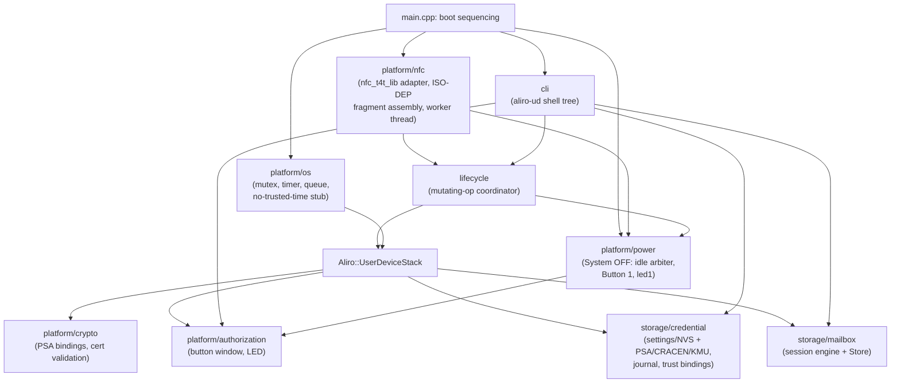

# Aliro NFC User Device — Architecture

This document describes the implemented Phase 1 application: its module
boundaries, how it relates to the checked-out `Aliro::UserDeviceStack`
facade, and how the nRF54LM20B DK NFC hardware is used. It supersedes the
earlier proof-of-concept architecture document; that behavior was removed
in AWP0. System OFF was reintroduced afterward as a standalone feature
(`src/platform/power/`, `docs/system_off_proposal.md`) - not as a numbered
Application Work Package - with the application otherwise remaining
powered while idle as AWP0 through AWP8 built it.

## Aliro roles: Reader vs User Device

| Role | NFC mode | Responsibility |
|------|----------|-----------------|
| **Reader** | Poll mode (PCD) | Generates the RF field, discovers the User Device, sends Access Protocol commands |
| **User Device** | Listen mode (PICC) | Responds in the reader's field, receives and replies to APDUs |

This application implements the **User Device (listen)** side, using the
DK's integrated NFCT peripheral (raw ISO-DEP mode via `nfc_t4t_lib`) rather
than the external ST25R200/ST25R300 transceiver the Reader reference
applications (`aliro-access-control-app`, `matter-aliro-door-lock-app`) use
in poller mode.

## Application versus stack boundary

The application owns:

- nRF54LM20B DK and antenna bring-up.
- NFC-A Type 4 Tag/ISO-DEP listen transport and field events.
- Zephyr execution primitives — timers, queues, and synchronization.
- PSA/CRACEN/KMU bindings for cryptographic primitives.
- Credential, per-reader-group trust, key, optional-document, and mailbox
  persistence.
- Button authorization, visible indication, and the development CLI.
- The `Aliro::Interface::UserDevice::*` implementations the checked-out
  stack requires (`Nfc`, `Os`, `Crypto`, `CredentialSigning`, `Credential`,
  `Trust`, `Authorization`, `Mailbox`).

The stack (`Aliro::UserDeviceStack`, west project `ncs-aliro`) owns:

- Aliro APDU and TLV encoding, decoding, chaining, and status words.
- The Session and Access Protocol state machines.
- `SELECT`, `AUTH0`, `LOAD CERT`, `AUTH1`, `EXCHANGE`, and `CONTROL FLOW`
  behavior.
- Aliro cryptographic orchestration and policy (KDF construction, protocol
  sequencing, which exact bytes are signed/encrypted/derived).

The application uses the checked-out `Aliro::UserDeviceStack` facade for
all stack-owned behavior and adds no fallback for absent or incomplete
stack features; where the public contract cannot represent required
behavior, the gap is recorded as `blocked-external-contract` or
`not-yet-verifiable` in `traceability.md` rather than worked around.

## Module layout and data flow



`main.cpp` performs boot sequencing only — no protocol logic. `platform/*`
and `storage/*` implement the application side of the checked-out public
`Aliro::Interface::UserDevice::*` contract; `Aliro::UserDeviceStack` is the
single facade every stack-owned behavior is routed through. `platform/power`
is the one exception to "no protocol logic in `platform/*`, only
`Aliro::UserDeviceStack`-facing adapters": it is pure application-level
power management, outside the Aliro protocol entirely, and is the only
module besides `main.cpp` with a boot-time `Start()` entry point rather
than a stack-facing interface implementation.

### NFC transport and the dedicated worker thread (`platform/nfc`)

`nfc_t4t_lib` (raw ISO-DEP mode; no NDEF payload is registered) calls into
`nfc_transport.cpp`'s callback only to copy/assemble bounded transport
fragments (`apdu_fragment_assembler.cpp`) and enqueue an event onto a
bounded queue — it never executes stack, storage, shell, or cryptographic
operations directly. A dedicated high-priority thread (`nfc_worker.cpp`)
drains that queue via `k_poll()`, multiplexed against a coalesced
field-lifecycle semaphore, and is the only caller of
`Aliro::UserDeviceStack::Instance().HandleCommandApdu()` /
`ProcessEvent()`.

This worker thread deterministically handles:

- Idempotent `FIELD_ON`/`FIELD_OFF` (duplicate activation/removal events are
  no-ops).
- Stack-driven session termination racing a field-loss event.
- Queue overflow: forces session recovery rather than silently dropping a
  `FIELD_OFF`.
- Command APDUs delivered with no session believed active: rejected
  deterministically, never forwarded to the stack.

Each response APDU is copied into a dedicated application-owned transmit
buffer that remains unchanged until the next `nfc_t4t_lib` callback
(`DATA_TRANSMITTED`, `DATA_IND`, or `FIELD_OFF`), satisfying the response-
buffer lifetime the public `Nfc` contract requires.

### OS bridge (`platform/os`)

Thin Zephyr-backed implementations of the checked-out `Interface::UserDevice::Os`
contract: mutex, timer, and a deferred-event queue. `os_trusted_time.cpp`
returns no trusted wall-clock timestamp — Phase 1 provisions no wall clock
and does not enforce Reader-certificate validity dates (see `platform/crypto`
below). `os_logging.cpp` bridges the stack's role-neutral logging interface
to Zephyr `LOG_*`.

### Cryptography (`platform/crypto`)

Thin PSA Crypto bindings for random/ephemeral-key generation, raw ECDH,
HKDF/HMAC-SHA-256 derivation, AES-GCM AEAD, ECDSA sign/verify, SHA-256, and
key destruction (`crypto.cpp`). `certificate.cpp` implements the one
non-thin operation: Aliro profile0000 DER decompression (Aliro
specification §13.3), constrained X.509 reconstruction, issuer-CA signature
verification, and subject-public-key extraction — with no wall-clock
validity-date check, since Phase 1 has none. `credential_signing.cpp`
resolves a `CredentialHandle` to its opaque PSA key identifier
(`storage/credential`) and signs through that identifier only; a raw
private-key scalar is never copied back into application memory.

### Authorization (`platform/authorization`)

A device-global, host-testable button-authorization window
(`authorization_window.{h,cpp}`) backing the `Interface::UserDevice::Authorization`
contract (`authorization.cpp`). The application policy treats AUTH0
`authentication_policy` values `0x01`, `0x02`, and `0x03` as all requiring a
valid window. The window is button-driven (`authorization_button.cpp`, DK
`Button 0`) and Kconfig-bounded to 1–300 seconds (default 30). No NFC
transaction blocks waiting for a button press: `GetState()` returns
synchronously so the stack fails the transaction promptly, and
`authorization_led.cpp` lights an LED whenever authorization is required
and no valid window exists.

### System OFF (`platform/power`)

A standalone power-management feature (`docs/system_off_proposal.md`), not
a numbered Application Work Package and not part of the Aliro protocol
surface. Wakes on NFC field detection (existing mechanism, unaffected) or a
Button 1 (`sw1`) press; sleeps on an explicit Button 1 press while awake,
or automatically after `CONFIG_ALIRO_UD_SYSTEM_OFF_IDLE_DELAY_S` (default
5 s) of no NFC field, unless a valid `AliroUd::Authorization::Window` is
open (Button 0's 30 s window must never be interrupted by an *automatic*
power-off; a deliberate Button 1 press still can be - operator is trusted
to know what they are doing).

`power_policy.{h,cpp}` is the pure, host-testable decision arbiter -
idle-deadline vs. window validity, manual-sleep request, and a
depth-counted mutation guard - with no Zephyr timer/GPIO/`sys_poweroff()`
dependency, mirroring `authorization_window.cpp`'s design. `power.cpp`
owns the one `sys_poweroff()` call site (suspending the console first, so
no shell/log output is truncated) plus the `k_work_delayable` idle timer;
`power_button1.cpp`/`power_indicator.cpp` are the DK-hardware-only `sw1`/
`led1` GPIO backends (`led0`'s existing "authorization required"
indication is untouched).

`AliroUd::Lifecycle::RunMutation()` brackets every mutating CLI operation
with the mutation guard: a power-off trigger that becomes due while a
`credential commit`/`delete`/`reset` or `mailbox init`/`reset` is in
flight is deferred, never dropped, and fires the instant the mutation
ends. The whole feature is Kconfig-gated
(`CONFIG_ALIRO_UD_SYSTEM_OFF`, default `y`): disabling it removes all
runtime power-off behavior with no other code changes, since this
module's sources are not even compiled in and every call site into it
elsewhere is wrapped in `IS_ENABLED(...)`.

### Credential and trust persistence (`storage/credential`)

Zephyr settings/NVS-backed non-secret metadata plus PSA/CRACEN/KMU-backed
private keys (`credential_store.cpp`, `key_backend_psa.cpp`,
`credential_persistence_settings.cpp`). Every binding is modeled as
`{ reader_group_identifier, trust_type, reader_group_identifier_key }`
(`credential_types.h`), independent per binding — multiple bindings on one
credential may use different keys. A four-phase crash-safe transaction
journal (`provisioning.h`) spans NVS and PSA key storage so that importing a
replacement key, switching committed metadata, and retiring the old key are
atomic across reset/power loss; boot-time recovery finishes or rolls back
any interrupted transaction and destroys unreferenced staged keys.

Non-secret metadata (bindings, policy, timestamps, optional-document
presence, mailbox configuration) is only ever mutated through the CLI's
in-memory staging transaction (`begin-create`/`begin-update`/field
setters/`commit`/`abort`) implemented in `src/cli/cli.cpp`; a `commit`,
`delete`, or factory reset always runs through `lifecycle` (below).

### Mailbox persistence (`storage/mailbox`)

Two layers: `mailbox_store.{h,cpp}` (a Credential-Issuer-level layer used
directly by the CLI, bypassing Reader `MailboxPermissions`, per Aliro
specification §8.3.1.15's "readable and writeable by the Credential
Issuer") and `mailbox_sessions.{h,cpp}` (the Reader-facing,
permission-enforcing session engine implementing
`Interface::UserDevice::Mailbox`'s snapshot/staged-mutation/atomic-commit/
rollback/close semantics, adapted in `mailbox.cpp`). Committed reads are
served from a session's snapshot copy, isolated from any other session's
staged writes; a session's entire staged buffer is applied to committed
storage in one atomic call on `Commit()`, and `Rollback()`/`Close()` leave
committed bytes unchanged. See `wp7_stack_impact.md` for the mid-project
`StageSet()` signature change and the `mailbox_data_subset` provisioning
surface this layer gained in response to a stack contract break.

### Development CLI (`src/cli`)

A Zephyr shell `aliro-ud` root command tree on the DK's virtual UART
(115200-8N1). Every leaf command returns exactly one deterministic
`OK ...`/`ERR ...` line and never prints secret values. Read-only commands
(`info`, `credential list/inspect/bindings`, `mailbox inspect/read`,
`auth status`, `timing stats`) may run at any time, including during an
active NFC session.

### Lifecycle coordinator (`src/lifecycle`)

Serializes every mutating CLI operation (`credential commit`/`delete`/
`reset`, `mailbox init`/`reset`) against the NFC worker thread: prevent new
activation, terminate any active stack session, perform the storage
transaction, then resume NFC service. This is the only path allowed to
mutate persistent credential/mailbox state while the NFC transport is live.

## Timing and resource instrumentation

`platform/nfc/command_timing.{h,cpp}` is a small, Kconfig-gated
(`CONFIG_ALIRO_UD_TIMING_INSTRUMENTATION`, default `y`) class measuring the
application boundary from command-APDU delivery to response send (wrapping
the single call into `HandleCommandApdu()` in `nfc_worker.cpp`), exposed
read-only via `aliro-ud timing stats`/`reset`. It compiles out entirely when
disabled (`target_sources_ifdef()`), so it adds no cost to production
builds. See `evidence/AWP7.md` for the measured FLASH/RAM delta and why no
normative numeric NFC timing bound applicable to this application's PICS
was found in the Aliro 1.0 Specification and Test Plan.

## Configuration

Key Kconfig options across the module tree:

| Option | Purpose |
|--------|---------|
| `CONFIG_NCS_ALIRO_USER_DEVICE` | Enable the checked-out `Aliro::UserDeviceStack` facade (module-supplied Kconfig/CMake integration) |
| `CONFIG_NFC_T4T_NRFXLIB` | NFC-A Type 4 Tag library (ISO-DEP listen mode) |
| `CONFIG_SHELL` | Development CLI over the DK virtual UART |
| `CONFIG_ALIRO_UD_AUTHORIZATION_WINDOW_SECONDS` | Button-authorization window length, 1–300 s (default 30) |
| `CONFIG_ALIRO_UD_MAILBOX_MAX_SESSIONS` | Concurrent open mailbox sessions (default 2, range 1–8) |
| `CONFIG_ALIRO_UD_MAILBOX_MAX_DATA_SUBSET_PAIRS` | Provisionable AUTH1 `mailbox_data_subset` pairs (default 4, range 0–32) |
| `CONFIG_ALIRO_UD_TIMING_INSTRUMENTATION` | Command-to-response timing instrumentation (default `y`, fully removable) |
| `CONFIG_ALIRO_UD_SYSTEM_OFF` | System OFF support: NFC-field/Button-1 wake, Button-1/auto-idle sleep (default `y`, fully removable) |
| `CONFIG_ALIRO_UD_SYSTEM_OFF_IDLE_DELAY_S` | Auto-sleep idle delay after NFC field-off, seconds (default 5) |
| `CONFIG_ALIRO_UD_SYSTEM_OFF_BUTTON1_SETTLE_MS` | Button 1 sleep-interrupt arming settle delay after boot, milliseconds (default 300) |
| `CONFIG_MAIN_STACK_SIZE` / `CONFIG_SHELL_STACK_SIZE` | Raised from Zephyr defaults after two on-target stack-overflow faults found in AWP4/AWP6; see `prj.conf` comments and `evidence/AWP4.md`/`AWP6.md` |

Board-specific overlay/conf files live under `boards/`.

## Source layout

```
applications/aliro-nfc-user-device/
├── CMakeLists.txt, Kconfig, prj.conf, sample.yaml
├── boards/
│   └── nrf54lm20dk_nrf54lm20b_cpuapp.{conf,overlay}
├── docs/
│   ├── architecture.md          (this document)
│   ├── provisioning.md
│   ├── traceability.md
│   ├── wp7_stack_impact.md
│   ├── STATE.md
│   └── evidence/AWP<n>.md
└── src/
    ├── main.cpp
    ├── lifecycle/lifecycle.h
    ├── platform/
    │   ├── nfc/        (nfc_transport, nfc_worker, apdu_fragment_assembler, command_timing)
    │   ├── os/         (os_mutex, os_timer, os_queue, os_trusted_time, os_logging, app_status, transaction)
    │   ├── crypto/      (crypto, certificate, credential_signing)
    │   ├── authorization/ (authorization, authorization_window, authorization_button, authorization_led)
    │   └── power/       (power, power_policy, power_button1, power_indicator)
    ├── storage/
    │   ├── credential/ (credential_store, credential_persistence_settings, key_backend_psa, credential_types, provisioning)
    │   └── mailbox/    (mailbox, mailbox_sessions, mailbox_store, mailbox_persistence_settings, mailbox_types)
    └── cli/cli.cpp
```

Host tests mirror this layout under
`tests/functional/subsys/aliro_nfc_user_device/{apdu_fragment_assembler,
authorization, cli_info, command_timing, crypto, host_smoke, mailbox,
power, worker_lifecycle}/`.

## References

- Aliro 1.0 Specification and Test Plan — queried through the `aliro-spec`
  MCP; see `docs/traceability.md` for the exact citation used at each
  requirement row and `docs/evidence/AWP<n>.md` for citations used to
  resolve implementation-time ambiguity.
- Checked-out `ncs-aliro` public headers:
  `include/aliro/user_device/{interface,types,mailbox}.h`.
- Nordic NFC Type 4 Tag library: `nrfxlib/nfc/include/nfc_t4t_lib.h`.
- Reader reference in this repository: `applications/aliro-access-control-app/`.
- `APP_PLAN.md` — the work-package plan and boundary rules this
  architecture implements.
